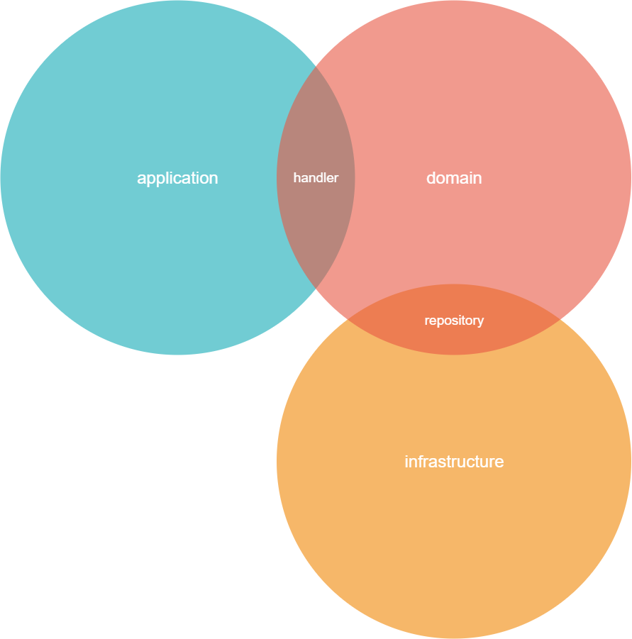

# Adidas Challenge

> This project is part of the Adidas hiring process for Senior Backend Developer following the proposed [premisses](./auxiliary-files/confirmed_challenge.pdf).

## Pre-requirements
- [jdk16](https://www.oracle.com/java/technologies/javase-jdk16-downloads.html)
- [maven](https://maven.apache.org/download.cgi)
- [docker-compose](https://docs.docker.com/compose/install/)
- [make](http://gnuwin32.sourceforge.net/packages/make.htm) (or installing [chocolatey](https://chocolatey.org/install) and running `choco install make`)

## How to

- Run: `make run`
> After execute it you can access the [Swagger](http://localhost:8080/documentation/swagger-ui/) page to test the endpoints.
- Stop: `make stop`

- Report: `make report`
> Coverage reports will be available at [JaCoCo Site](./target/site/jacoco/index.html) in `target` folder.

## Decision Making

> Coding premises were `DDD`, `Hexagonal Architecture` and `SOLID` principles.

  

- *Application*: Responsible to be the connection point to the application with the "external world", exposing request and response entities;
- *Handler*: Where the externalized entities are translated to domain objects;
- *Domain*: Part of the structure where business logic and internal entities representation take form;
- *Repository*: Connection between the infrastructure components and domain logic. This logic will be responsible to get information from the infra and translate to domain objects 
- *Infrastructure*: Representation of infra components that are relevant for the application, such as database, cache, networks communications and etc.

> Application itself serve its purpose with sufficient entities not needing external integrations (given a POC oversimplification), so for complex problems as `transaction control` in microservices, I am relying on transaction rollback instead of `Event Sourcing` or `SAGA` pattern.

### Personal Considerations

- There was no endpoint to create a product, so I took the freedom to create a `POST` one under `/product`.
- `product` is a resource from the application, so its exposing in REST services should be plural instead.
- `PATCH` method considers an existent resource to apply partial updates, so I would split the creation to `POST` and the partial stock update to `PATCH` instead both in the same method.
- At `unreserve` and `sold` have signs to be `PUT` methods, once they are dependent of a resource creation (aka `reservationToken`) to manipulate an existent status.
- Services that produce no result could receive status code `NO_CONTENT` instead `OK` once they don't result entities for the service call and there are no asynchronous processing unfinished.
- Service `/product/:id/sold` naming doesn't follow REST common practices, or even the other services naming pattern, in order to execute a command. I'd recommend `/product/:id/sell` instead.
- MongoDB is not a relational DB, so there will be indeed redundancies regarding data saved. What was tried is keep the data structure as simple as possible in order to serve the application (aka, challenge) fast and usable.
- Once `Webflux` and `springboot mongodb reactive` were used, the whole application already works in a non-blocking way.  

### Tech Stack

- Kotlin
- MongoDB
- Spring-Boot (mongodb-reactive and webflux)
- Docker
- Makefile

### Future Steps

- Real database running in cloud because locally is not scalable at all
- Add authentication to MongoDB container
- Coded infrastructure (terraform & kubernetes)
- Apply security to run Swagger
- Provide performance tests with Gatling or JMeter
- Provide `API tests`
- Implement `pessimistic lock` for saving transactions

